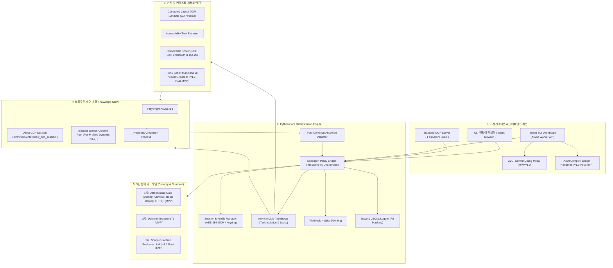
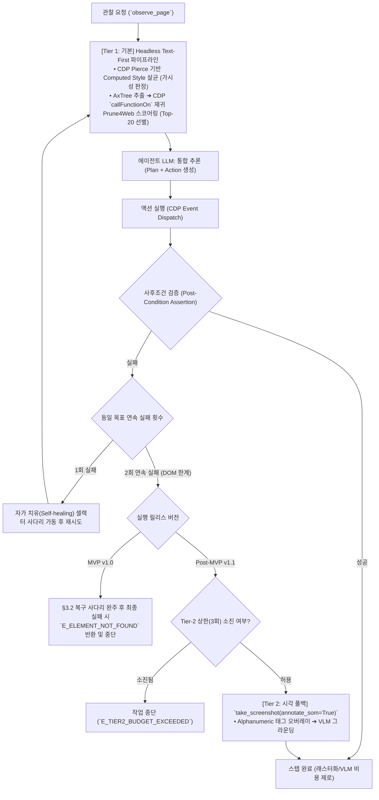
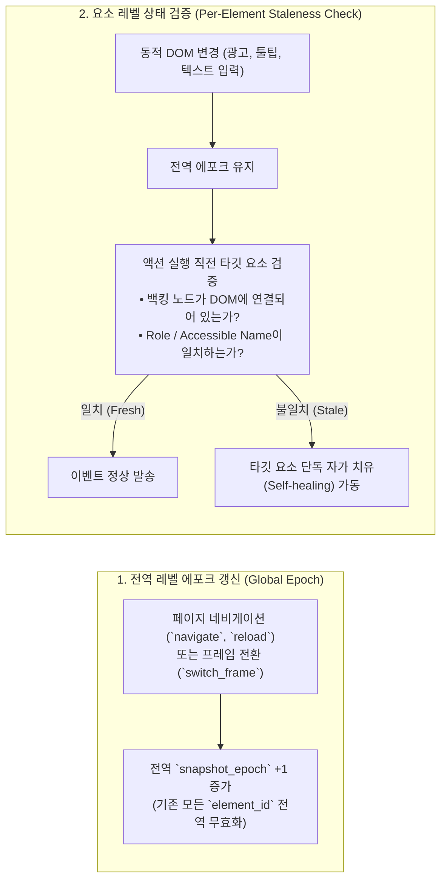
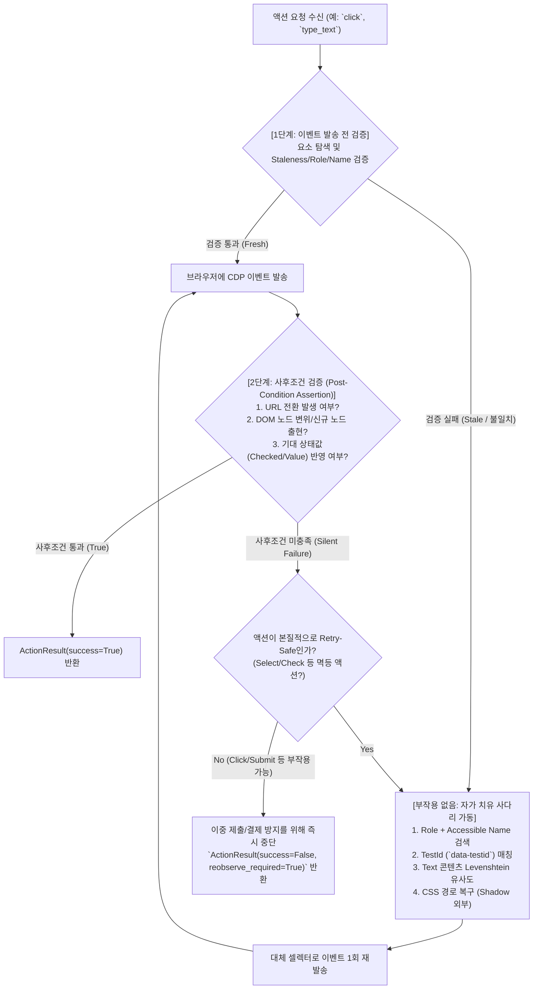
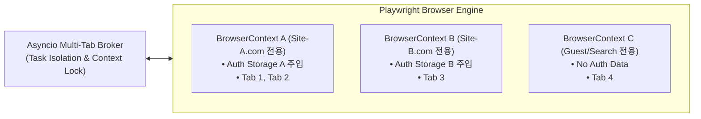

# AI 에이전트 전용 헤드리스 브라우징 인프라: PRD & 기술 아키텍처 명세서 (v13.0)

| 항목 | 내용 |
| :--- | :--- |
| **문서 버전** | v13.0 (Ultimate Final Implementation Baseline - Review #01 ~ #12 전건 반영 완결본) |
| **작성일** | 2026-08-29 |
| **개발 언어 및 런타임** | **Python 3.11+ (`asyncio`, Pydantic V2, `uv`, Playwright CDP)** |
| **구현 주체 (Implementation)** | **Autonomous AI Coding Agents (6개 배타적 컨텍스트 격리 워크스트림)** |
| **감독 및 승인 주체 (Supervisor)** | **Human Systems Supervisor & Core Architecture Council** |
| **문서 상태** | **Approved - Final Implementation Baseline (MVP v1.0 & Post-MVP v1.1)** |

### 📋 변경 이력 (Revision History)

| 버전 | 개정일 | 주요 변경 내역 | 상태 |
| :--- | :--- | :--- | :--- |
| **v1.0 ~ v11.0** | 2026-08-29 | 19종 툴, 바이트 무결성(CR/LaTeX/BEL 0개), AI 실행 파이프라인, 기계 검증 체계 수립 | Superseded |
| **v12.0** | 2026-08-29 | Stage 0 모델 코드화, Protocol 구체 타입 확정, 8M 토큰 예산 배분, Stage 3 분할 | Superseded |
| **v13.0** | 2026-08-29 | **[P1-1] `ClickInput` 상호 배타성(`element_id` vs `selector` 정확히 1개) 및 `epoch` 조건부 필수 validator 완성, [P2-3] Gate 0 기계 검증 항목(Input 모델 19종 및 스모크 테스트) 신설, [P2-4] `ACTION_INPUT_MAP` 정의 및 `ActionDispatcherProtocol`의 `params: BaseModel` 타입 바인딩, [P2-5] `NavigateInput.wait_until`에 `"commit"` 복원 및 Checkpoint 3-A(1~4)/3-B(1~8) 번호 독립화, [check_docs] 4대 무결성 검증 및 104개 전수 매트릭스 일치** | **Approved** |

---

## 0. 언어 및 코어 엔진 선정 결정 이력 (Decision Architecture Log)

본 프로젝트는 고성능 헤드리스 브라우징 엔진 구축을 위해 Go(`rod`)와 Python(`playwright`) 스택을 심층 비교 검토하였으며, 최종적으로 **Python 3.11+ & Playwright Async 스택**을 채택하였습니다. 선정 근거 및 수용된 실제 기술적 트레이드오프는 다음과 같습니다.

| 평가 영역 | Go + Rod 검토 결과 | Python + Playwright 최종 채택 근거 | 수용된 트레이드오프 및 대응 방안 |
| :--- | :--- | :--- | :--- |
| **세션 지속성 (`storageState`)** | 표준 직렬화 규격 부재로 Cookie/Storage 덤프·주입 엔진을 자체 개발해야 함 (구현 공수 및 Flaky 위험 높음) | Playwright 표준 `storageState` JSON 입출력을 통해 완벽한 세션 보존 및 복원 보장 | `storageState`는 `sessionStorage` 및 `IndexedDB`를 자동 포함하지 않음 ➔ `add_init_script` 및 `launch_persistent_context` 폴백 명시 (§5.1) |
| **결정론적 동기화 (Auto-waiting)** | 요소 상태별(Visible, Enabled, Stable) 대기 로직을 수동 구현해야 하므로 비결정론적 실패 증가 | Playwright 내장 **Actionability 자동 대기(Auto-waiting)** 메커니즘으로 **Flaky율 ≤ 2%** 즉시 달성 | Actionability 대기는 Canvas 및 Closed Shadow DOM 내부에서 무력화 ➔ CDP pierce 순회 및 v1.1 SoM 시각 폴백 결합 (§4.3) |
| **관측성 및 디버깅 생태계** | CDP 트레이스 뷰어 미비로 실패 세션 디버깅 시 자체 레코더 구축 필요 | `context.tracing` ➔ `trace.zip` ➔ **Playwright Trace Viewer** 연동으로 스텝별 완벽 리플레이 지원 | Tracing 파일의 디스크 I/O 및 용량 오버헤드 ➔ 실패 시에만 `trace.zip` 저장 및 7일/5GB LRU 보존 정책 적용 (§8) |
| **AI 및 에이전트 생태계 통합** | Go SDK 부재/미성숙으로 Pydantic 및 LangChain/LlamaIndex 상호 운용에 추가 어댑터 필요 | **Pydantic V2**, **MCP Python SDK**, 비동기 LLM 클라이언트 생태계와 100% 네이티브 호환 | Python GIL로 인한 CPU 집약 연산(Levenshtein, DOM 정렬) 병목 ➔ `asyncio.to_thread`로 워커 스레드 오프로딩 (§5.2) |
| **런타임 및 동시성 제약** | 순수 단일 바이너리, 초경량 Goroutine | **사용자의 별도 Node.js 수동 설치가 불필요한 독립 Python 패키지** (`playwright` 휠 내 드라이버 바이너리 자체 번들) | • Node 드라이버 서브프로세스 메모리 점유(~50MB/인스턴스)<br>• API가 멀티스레드-안전하지 않음 ➔ 단일 이벤트 루프 내 코루틴 락(`asyncio.Lock`) 강제 (§5.2) |
| **패키징 및 배포** | 단일 바이너리 배포 | 가상환경 및 Python 인터프리터 의존성, 브라우저 바이너리(~300MB) 별도 설치 | Rust 기반의 초고속 **`uv`** 패키지 매니저 및 Docker 베이스 이미지 표준화로 배포 복잡도 해소 (§8) |

---

## 1. 제품 정의 및 전략 (Product Requirements)

### 1.1 제품 비전 및 포지셔닝 (Vision & Differentiation)
기존 웹 브라우저는 인간의 시각적 인지(GUI)와 마우스/키보드 입력에 맞춰 설계되어 있어, AI 에이전트 구동 시 토큰 낭비, 비결정론적 실행 실패, 불필요한 렌더링 지연을 초래합니다.
**본 제품은 인간 중심의 그래픽 렌더링 비용을 원천 차단하고, Python 3.11+ 비동기 런타임 기반으로 에이전트 인지 구조와 완벽히 동기화된 "Agent-Native Headless Browsing Engine & MCP Server"를 제공합니다.**

#### 🚀 경쟁 오픈소스 대비 차별점 (What Makes Us Unique)
* **browser-use 대비**: 단순 원시 DOM 덤프 방식에서 벗어나, WebArena 100개 샘플 기준 원시 DOM을 95% 이상 압축(`tiktoken cl100k_base` 기준)하는 `AxTree + Prune4Web` 파이프라인과 **스냅샷 에포크(Epoch) 기반의 TOCTOU 방지 및 사후조건 검증(Post-Condition Assertion) 자가 치유 사다리**를 내장.
* **Stagehand 대비**: 무거운 프레임워크 래핑 없이 **Python 네이티브 `asyncio` + Playwright CDP**로 통합하여 AI/LLM 생태계(Pydantic, LangChain, LlamaIndex)와의 완벽한 상호 운용성 보장.
* **Steel Browser 대비**: 외부 클라우드 인프라 종속 없이 **로컬 및 프라이빗 클라우드에 100% 임베딩 가능**하며, 표준 **MCP(Model Context Protocol)** 서버를 기본 내장하여 Claude Desktop, Cursor 등 외부 에이전트에 브라우징 도구 즉시 제공.

---

### 1.2 타깃 페르소나 (Target Personas)

| 페르소나 | 주요 업무 및 니즈 | 핵심 페인 포인트 | 본 제품을 통한 해결 가치 |
| :--- | :--- | :--- | :--- |
| **Persona A: 엔터프라이즈 RPA 개발자** | ERP, 인트라넷, B2B 포털의 정기 데이터 수집 및 폼 자동 작성 | 세션 만료, 2FA 반복 로그인, 잦은 UI 변경으로 정적 셀렉터 파손 | `storageState` AES-256-GCM 암호화 캐싱, 자가 치유(Self-healing) 셀렉터 |
| **Persona B: AI 에이전트 프레임워크 저자** | LangChain, LlamaIndex, AutoGen 등에서 웹을 도구(Tool)로 사용하는 자율 에이전트 구축 | 원시 HTML 주입 시 토큰 폭증(100k+), 비싼 LLM 비용, 단일 스레드 지연 | AxTree 프루닝(Recall@20 ≥ 95%), `asyncio` 기반 고성능 탭 제어, 표준 MCP 인터페이스 |
| **Persona C: QA 및 웹 통합 테스트 엔지니어** | SPA, 다중 탭 연계 플로우, iframe/Shadow DOM 기반 E2E 검증 | 비동기 렌더링 시 대기 실패, Shadow DOM 미지원, 테스트 플레이키(Flaky) | 결정론적 동기화, Shadow DOM 투명 피어싱, 스텝별 완벽 Replay Trace |

---

### 1.3 핵심 유즈케이스 및 수용 기준 (User Stories & Acceptance Criteria)

#### Scenario 1: 인증 기반 대시보드 무인 데이터 수집 `[MVP v1.0]`
* **User Story**: 사내 자동화 엔지니어는 1회 인증 후, 매일 밤 백그라운드 무인 모드에서 보안 대시보드에 접근하여 매출 리포트 CSV를 다운로드받는다.
* **수용 기준 (Acceptance Criteria)**:
  1. 최초 1회 대화형 로그인 시 Cookies/LocalStorage가 AES-256-GCM 암호화되어 저장된다.
  2. 무인 실행(`--mode=unattended`) 시 별도 로그인 절차 없이 즉시 대시보드에 진입하여 `download_file` 액션으로 CSV를 획득한다.
  3. 세션 만료 발생 시 무인 모드는 즉시 작업을 중단하고 `E_AUTH_EXPIRED` 에러와 함께 웹훅 알림을 발행한다.

#### Scenario 2: 다단계 폼 입력 및 고위험 액션 승인 `[MVP v1.0]`
* **User Story**: 에이전트가 채용 포털에서 지원서 양식을 작성하고 PDF 이력서를 업로드하되, 최종 제출 전 사용자 승인을 받는다.
* **수용 기준 (Acceptance Criteria)**:
  1. `type_text`, `select_option`, `upload_file` 액션이 단계별로 정확히 수행된다.
  2. 최종 "제출" 등 고위험 액션 도달 시 대화형 TUI 상에 A2UI 최소 스펙인 **`ConfirmDialog` 네이티브 모달**을 띄워 사용자 승인을 획득한 후 실행한다.

#### Scenario 3: 격리된 다중 탭 비교 조사 `[MVP v1.0]`
* **User Story**: 에이전트가 3개 쇼핑몰 사이트를 동시에 열고 가격을 비교한다.
* **수용 기준 (Acceptance Criteria)**:
  1. 서로 다른 오리진(Origin) 사이트는 사전 등록된 프로파일 기반의 독립 `BrowserContext`로 격리되어 인증 정보가 상호 유출되지 않는다. (임의 도메인 동적 컨텍스트는 v1.1 지원).
  2. `tab_control` 액션을 통해 컨텍스트 락 경합 없이 코루틴 안전하게 탭을 제어한다.

#### Scenario 4: 동적 SPA 무한 스크롤 및 Shadow DOM 조작 `[MVP v1.0]`
* **User Story**: Web Components 및 Shadow DOM으로 캡슐화된 최신 SPA 페이지의 요소를 조작한다.
* **수용 기준 (Acceptance Criteria)**:
  1. Open/Closed Shadow Root 내부의 요소도 투명하게 AxTree에 바인딩되어 클릭 및 입력이 가능하다.
  2. 무한 스크롤 시 `scroll` 실행 후 반환된 `reobserve_required=True` 신호를 감지하고 `observe_page()`를 재호출하여 신규 렌더링된 노드를 정상 인입한다.

#### Scenario 5: 난독화 DOM 대응 및 시각적 자가 치유 `[Post-MVP v1.1]`
* **User Story**: 안티스크래핑 난독화나 Canvas 렌더링으로 텍스트 DOM 조작이 2회 연속 실패할 경우 시각적 SoM 모드로 전환한다.
* **수용 기준 (Acceptance Criteria)**:
  1. 텍스트 셀렉터 탐색이 2회 연속 실패 시 Tier-2(SoM Vision) 모드로 즉시 에스컬레이션된다.
  2. `take_screenshot(annotate_som=True)` 액션으로 뷰포트 상에 영숫자 태그(`[#1]`, `[#2]`)가 오버레이된 스크린샷을 생성하여 VLM이 정확한 타깃을 식별한다.

---

### 1.4 비목표 (Non-Goals) 및 준법 정책
1. **CAPTCHA 자동 해킹/우회 불가**: CAPTCHA 발생 시 자동 해킹을 시도하지 않으며, HITL 모드로 전환하여 사용자가 직접 풀도록 유도합니다.
2. **웹사이트 ToS 및 robots.txt 준수**: 과도한 트래픽 유발을 방지하는 기본 지수 백오프 및 도메인별 Rate-Limiter를 강제합니다.
3. **일반 사용자용 웹 브라우저 대체 아님**: 오직 AI 에이전트 런타임 및 개발자 디버깅 TUI로만 범위를 한정합니다.

---

### 1.5 정량적 성공 지표 및 통일된 수치 계약 (Unified KPIs & Metrics)

| 지표 범주 | 세부 지표명 | 릴리스 범위 | 측정 기준 및 테스트 환경 (기준 정의) | 계약 목표치 (Target) |
| :--- | :--- | :---: | :--- | :--- |
| **인프라 코어** | **정답 요소 생존율 (Element Recall@20)** | **MVP v1.0** | WebArena 100개 샘플 페이지 프루닝 후 Top-20 요소 내 정답 포함 비율 | **≥ 95.0%** |
| **인프라 코어** | **스텝당 관찰 토큰 (Observation Tokens)** | **MVP v1.0** | 단일 스텝 입력 토큰 (`tiktoken cl100k_base` 기준, p50 / p95) | **p50 ≤ 2,500 / p95 ≤ 6,500** |
| **인프라 코어** | **스텝당 로컬 순수 지연 (Step Latency)** | **MVP v1.0** | (a) 관찰/프루닝 ≤ 300ms + (b) 단일 액션 실행/사후검증 ≤ 500ms (외부 네트워크 지연 제외) | **p50 ≤ 800ms** |
| **인프라 코어** | **복합 스텝 지연 (Complex Latency)** | **MVP v1.0** | 자가치유 1회전 포함 (외부 원격 서버 응답 시간 제외) | **p95 ≤ 2,200ms** |
| **인프라 코어** | **액션 실행 성공률 (Action Success Rate)** | **MVP v1.0** | WebArena Lite 100개 태스크 및 Mock 20종 사이트에서 정상 식별 요소 이벤트 트리거 성공률 | **≥ 92.0%** |
| **인프라 코어** | **자가 복구 성공률 (Self-healing Rate)** | **MVP v1.0** | WebArena Lite 100개 태스크 및 Mock 20종 사이트에서 셀렉터 불일치 시 복구 성공률 | **≥ 80.0%** |
| **인프라 코어** | **테스트 플레이키율 (Flaky Rate)** | **MVP v1.0** | 동일 고정 Mock 사이트 100회 반복 실행 시 비결정론적 실패율 | **≤ 2.0%** |
| **에이전트 참조** | **태스크 완수율 (Reference Agent SR)** | **MVP v1.0** | WebArena Lite 100개 태스크 (Claude 3.7 Sonnet 고정, 최대 15스텝, 1회 리트라이) | **≥ 60.0%** (스트레치 68%) |
| **보안** | **결정론적 IPI 차단율** | **MVP v1.0** | WASP 인젝션 테스트셋 중 도메인/Egress 1차 방어선 차단율 (고위험 액션 HITL 강제) | **≥ 90.0%** |
| **보안 & VLM** | **종합 IPI 차단율 (3중 방어)** | **v1.1** | WASP(가드레일 미적용 베이스라인 35% 대비 ≥98%) 및 StakeBench(베이스라인 42% 대비 ≥96%), FPR ≤ 2% (논문 공식 보고치 기준) | **WASP ≥ 98.0% / StakeBench ≥ 96.0%** |
| **비용 & 효율** | **Tier 2 (SoM) 발동 비율** | **v1.1** | 무인 모드 실행분 기준 태스크당 발동 빈도 (태스크당 최대 3회/30스텝으로 10% 엄격 강제, 대화형은 디버깅 재량 최대 5회) | **≤ 10.0%** |
| **비용 & 효율** | **Tier 2 VLM 지연 (Vision Latency)** | **v1.1** | 스크린샷 인코딩 + SoM 태깅 + VLM 비전 추론 왕복 시간 (외부 API 왕복을 유일하게 포함) | **p95 ≤ 3,500ms** |
| **비용 & 효율** | **스텝당 LLM 호출 예산** | **MVP v1.0** | 일반 스텝 vs 최악(가중치 갱신+가드레일+SoM) 스텝 | **기본 1회 / 전역 상한 3회** |

---

## 2. 시스템 아키텍처 및 계층 구조 (System Architecture)



---

## 3. 단계적 인지 사다리, 에포크 정책 및 실행 모드

### 3.1 Tier 1/2 단계적 인지 사다리 (Tiered Escalation Ladder)



* **Tier 1 (기본 모드 - Pure Headless Text, MVP v1.0)**:
  - 브라우저 화면의 래스터화(Rasterization) 및 이미지 생성을 일체 수행하지 않음.
  - Computed Style 기반으로 가시성(`display:none`, `opacity:0`, Off-screen)을 판정하여 노이즈 제거 후 Top-20 요소 추출.
* **Tier 2 (조건부 시각 폴백 - SoM Vision Grounding, Post-MVP v1.1)**:
  - Canvas 기반 UI, 심각한 DOM 난독화, 텍스트 셀렉터 **2회 연속 실패 시**에만 제한적 가동 (전체 트래픽의 10% 이하).

---

### 3.2 Top-N 프루닝 실패 복구 사다리 및 에포크 억제 (Recall Loss Recovery)
Top-20 요소 내에 정답이 없을 경우(약 5% 확률), 에이전트가 영구 실패에 빠지지 않도록 4단계 복구 사다리를 가동합니다.

1. **1단계 (N 확장 재프루닝)**: 후보 요소 수를 N=20 → N=50으로 확장하여 스코어링 재평가.
2. **2단계 (시맨틱 키워드 재검색)**: 사용자의 원래 목표 키워드를 기반으로 DOM 텍스트/Aria-label 정밀 매칭 필터링.
3. **3단계 (Full AxTree 폴백)**: 프루닝을 생략하고 정제된 전체 접근성 트리(AxTree)를 직접 컨텍스트에 주입.
4. **4단계 (스크롤 후 뷰포트 재관찰)**: 뷰포트를 아래로 스크롤하여 지연 로딩(Lazy-loading)된 노드를 인입 후 1단계부터 재수행.

> **💡 복구 사다리 에포크 억제 규칙**: 1단계부터 4단계까지의 복구 사다리가 내부적으로 수행되는 동안에는 `scroll` 등이 발생하더라도 **전역 에포크 갱신을 억제**하며, 사다리 처리가 완전히 완료되어 최종 후보군이 확정된 시점에 단일 스냅샷과 함께 에포크를 1회만 발행합니다.

---

### 3.3 대화형 vs 무인 실행 모드 정책 (Interactive vs Unattended Policy)

| 구분 | 대화형 모드 (`--mode=interactive`) | 무인/CI/MCP 모드 (`--mode=unattended`) |
| :--- | :--- | :--- |
| **실행 주체** | 개발자 터미널 (Textual TUI / CLI) | 야간 크론잡, CI 파이프라인, 외부 MCP 클라이언트 |
| **고위험 액션 (결제/삭제/제출)** | A2UI `ConfirmDialog` 모달을 띄워 사용자 수동 승인 대기 `[MVP]` | **사전 승인 화이트리스트(`pre_approved_actions`) 외 액션은 즉시 차단 및 `E_HITL_UNATTENDED_BLOCKED` 반환** |
| **Tier-2 시각 폴백 상한 `[v1.1]`** | 태스크당 최대 5회 허용 (개발자 디버깅 재량 보장) | **태스크당 최대 3회로 엄격 제한 (전체 스텝 대비 10% 이내 방어, 초과 시 `E_TIER2_BUDGET_EXCEEDED`)** |
| **세션 만료 (`E_AUTH_EXPIRED`)** | 대화형 1회 로그인 브라우저 팝업 트리거 | **작업 즉시 중단(Fail-Fast), 실패 로그 기록 및 설정된 Webhook 알림 발송** |
| **CAPTCHA / 봇 감지** | 사용자에게 브라우저 제어권 인계 | **작업 즉시 중단(Fail-Fast) 및 `E_CAPTCHA_DETECTED` 웹훅 알림 발송** |
| **Egress 네트워크 정책** | 정책 모드 (`strict` / `ask` / `open_sandbox`) | `strict` (사전 등록된 `allowed_domains` 외 모든 외부 요청 차단. 탐색 태스크는 `open_sandbox` 명시 필요) |

---

### 3.4 전역 루프, 비용 상한 및 리소스 가드 (Global Loop & Resource Guard)
* **최대 스텝 수 상한**: 단일 태스크당 최대 30스텝 초과 시 자동 중단 (`E_MAX_STEPS_EXCEEDED`).
* **실행 시간 상한**: 태스크당 최대 Wall-Clock Time 10분 초과 시 타임아웃 (`E_TIMEOUT`).
* **태스크당 비용 상한**: 단일 태스크의 누적 LLM 사용량이 **100,000 토큰 또는 USD $0.75 중 먼저 도달하는 기준 적용** (`E_COST_LIMIT_EXCEEDED`).
  - *산술 근거*: Claude 3.7 Sonnet 기준(입력 $3.00/1M, 출력 $15.00/1M), p50 기준 30스텝(30스텝 × 2,500토큰 = 75,000 입력 토큰 + ~10,000 출력 토큰 = 약 85,000 토큰 ≈ $0.38)은 안전하게 수용하며, p95 토큰 폭증(단일 스텝 6,500토큰) 시 15~20스텝 시점에서 조기 차단하여 비정상 과금을 방지함.
  - *v1.1 SoM 이미지 토큰 산정*: v1.1에서 Tier-2 SoM 스크린샷 캡처 시 표준 뷰포트 해상도 **1280×720 (1x DPI)** 기준 장당 약 1,600 토큰이 본 100,000 토큰 상한에 누적 합산됨.
* **동일 액션 반복 감지**: 동일한 `(action, selector, value)` 조합이 연속 3회 실패 시 즉시 중단.
* **리소스 및 탭 상한**:
  - 세션당 최대 탭 수 10개, 동시 활성 `BrowserContext` 최대 5개로 제한.
  - 프로세스 메모리 사용량이 1.5GB를 초과할 경우 유휴(Inactive) 탭의 DOM 리소스를 자동 동결(Discard)하며, 한도 초과 시 `E_TAB_LIMIT_EXCEEDED` 반환.

---

## 4. 완전한 19종 액션 툴 명세 & Pydantic V2 모델 (Stage 0 Frozen Models)

에이전트 및 MCP 클라이언트가 브라우저를 제어하기 위한 **19종 툴 전수 명세(서브커맨드 포함 실효 22개)** 및 `WS-0 contracts/` 선행 동결 모델입니다.

```python
from enum import Enum
from typing import Literal, Optional, List, Dict, Any, Type, Union
from pydantic import BaseModel, Field, model_validator

class ActionType(str, Enum):
    # 1. 관찰 & 캡처 (Observation Primitives)
    OBSERVE_PAGE = "observe_page"
    TAKE_SCREENSHOT = "take_screenshot"
    # 2. 내비게이션 (Navigation)
    NAVIGATE = "navigate"
    GO_BACK = "go_back"
    RELOAD = "reload"
    # 3. 상호작용 (Interaction)
    CLICK = "click"
    TYPE_TEXT = "type_text"
    SELECT_OPTION = "select_option"
    CHECK_BOX = "check_box"
    SCROLL = "scroll"
    HOVER = "hover"
    PRESS_KEY = "press_key"
    # 4. 대기 및 추출 (Sync & Extraction)
    WAIT_FOR = "wait_for"
    EXTRACT = "extract"
    # 5. 복합 웹 제어 (Complex Primitives)
    SWITCH_FRAME = "switch_frame"
    HANDLE_DIALOG = "handle_dialog"
    UPLOAD_FILE = "upload_file"
    DOWNLOAD_FILE = "download_file"
    TAB_CONTROL = "tab_control"

# -------------------------------------------------------------
# 1. 관찰 반환 모델 (Perception Return Models)
# -------------------------------------------------------------
class BBox(BaseModel):
    x: int
    y: int
    width: int
    height: int

class ObservedElement(BaseModel):
    element_id: str                      # "@e1", "@e2"
    role: str
    name: str
    value: Optional[str] = None
    bbox: BBox
    interactable: bool
    is_shadow: bool = False
    score: float

class ObserveResult(BaseModel):
    title: str
    url: str
    snapshot_epoch: int
    elements: List[ObservedElement]
    axtree_summary: str
    token_count: int

# -------------------------------------------------------------
# 2. 액션 결과 모델 (Action Result Model)
# -------------------------------------------------------------
class ActionResult(BaseModel):
    success: bool
    action: ActionType
    current_url: str
    snapshot_epoch: int
    tab_id: str
    healed: bool = False                            # 자가 치유 적용 여부
    reobserve_required: bool = False                # 스크롤/TOCTOU 등으로 재관찰 필요 여부
    retry_safe: bool                                # 멱등성/재시도 안전 여부
    downloaded_path: Optional[str] = None           # 다운로드 완료된 로컬 파일 경로
    popup_tab_id: Optional[str] = None              # 액션으로 생성된 신규 탭 ID
    error_code: Optional[str] = None
    error_message: Optional[str] = None
    data: Dict[str, Any] = Field(default_factory=dict)

# -------------------------------------------------------------
# 3. 대표 액션 입력 모델 (Action Input Schemas)
# -------------------------------------------------------------
class ClickInput(BaseModel):
    element_id: Optional[str] = None
    selector: Optional[str] = None
    epoch: Optional[int] = None
    expected_role: Optional[str] = None
    expected_name: Optional[str] = None
    button: Literal["left", "right", "middle"] = "left"

    @model_validator(mode="after")
    def check_target_and_epoch(self) -> "ClickInput":
        # 1. element_id와 selector 중 정확히 하나만 지정 강제
        if bool(self.element_id) == bool(self.selector):
            raise ValueError("element_id와 selector 중 정확히 하나만 지정해야 합니다.")
        # 2. element_id 사용 시에만 epoch 필수 검증
        if self.element_id and self.epoch is None:
            raise ValueError("element_id를 지정할 경우 snapshot epoch는 필수입니다.")
        return self

class TypeTextInput(BaseModel):
    element_id: str
    text: str
    clear_before: bool = True
    press_enter: bool = False
    epoch: int

class NavigateInput(BaseModel):
    url: str
    wait_until: Literal["domcontentloaded", "load", "networkidle", "commit"] = "domcontentloaded"
    timeout_ms: int = 15000
```

> **📌 Stage 0 산출물 규약**: 위 3종 외 나머지 16종 액션의 입력 모델(`ScrollInput`, `SelectOptionInput` 등)은 §4.1 표의 필드 정의를 1:1 기반으로 `contracts/inputs.py`에 전수 정의하여 `ACTION_INPUT_MAP: Dict[ActionType, Type[BaseModel]]` 매핑과 함께 동결합니다.

### 4.1 19종 액션 툴 전수 명세표

| 액션명 (`ActionType`) | 주요 입력 필드 (Pydantic V2 Model) | 멱등성 (`retry_safe`) | 주요 부작용 (Side Effects) 및 반환값 | 발생 가능한 에러 코드 |
| :--- | :--- | :---: | :--- | :--- |
| `observe_page` | `tab_id: Optional[str]`, `prune_top_n: int = 20`, `force_full_tree: bool = False` | **Yes** | 페이지 상태를 읽고 `ObserveResult` 반환 | `E_TAB_NOT_FOUND`, `E_PAGE_CRASHED` |
| `take_screenshot` | `tab_id: Optional[str]`, `annotate_som: bool = False`, `full_page: bool = False` | **Yes** | 스크린샷 캡처 반환 (`annotate_som=True`는 v1.1 활성화 전까지 `E_FEATURE_NOT_IMPLEMENTED` 반환) | `E_SCREENSHOT_FAILED`, `E_FEATURE_NOT_IMPLEMENTED` |
| `navigate` | `NavigateInput` (`url`, `wait_until`, `timeout_ms`) | **Yes** | 페이지 이동, `snapshot_epoch` 증가 | `E_NAVIGATE_TIMEOUT`, `E_INVALID_URL` |
| `go_back` | `timeout_ms: int = 10000` | **Yes** | 이전 세션 히스토리로 이동 | `E_NO_HISTORY` |
| `reload` | `ignore_cache: bool = False` | **Yes** | 현재 페이지 재로딩 | `E_NAVIGATE_TIMEOUT` |
| `click` | `ClickInput` (`element_id`, `selector`, `epoch`, `expected_role`, `expected_name`, `button`) | **Depends (실패단계 종속)** | 포커스 이동, 페이지 이동, 팝업 탭 생성(`popup_tab_id`) | `E_ELEMENT_NOT_FOUND`, `E_TOCTOU_MISMATCH`, `E_ELEMENT_NOT_INTERACTABLE` |
| `type_text` | `TypeTextInput` (`element_id`, `text`, `clear_before`, `press_enter`, `epoch`) | **Depends (실패단계 종속)** | 폼 필드 값 갱신, 드롭다운 자동완성 트리거 | `E_ELEMENT_NOT_FOUND`, `E_TOCTOU_MISMATCH` |
| `select_option` | `element_id: str`, `value: Optional[str]`, `index: Optional[int]`, `epoch: int` | **Yes** | Select 드롭다운 옵션 변경 | `E_OPTION_NOT_FOUND`, `E_ELEMENT_NOT_FOUND` |
| `check_box` | `element_id: str`, `checked: bool`, `epoch: int` | **Yes** | 체크박스/라디오 버튼 토글 | `E_ELEMENT_NOT_FOUND` |
| `scroll` | `direction: Literal["up", "down"]`, `distance: int = 500`, `target_element_id: Optional[str] = None` | **Yes** | 뷰포트 스크롤, 동적 노드 로딩 시 `reobserve_required=True` 반환 | `E_SCROLL_FAILED` |
| `hover` | `element_id: str`, `epoch: int` | **Yes** | 마우스 호버 상태 변경, 툴팁/서브메뉴 노출 | `E_ELEMENT_NOT_FOUND` |
| `press_key` | `key: str` (e.g. `"Enter"`, `"Tab"`, `"Escape"`) | **No** | 키보드 이벤트 발생 | `E_KEY_PRESS_FAILED` |
| `wait_for` | `condition: Literal["selector", "network_idle", "spa_route", "stabilize"]`, `selector: Optional[str]`, `timeout_ms: int = 10000` | **Yes** | 대기 완료까지 비동기 코루틴 블로킹 | `E_TIMEOUT` |
| `extract` | `selector: str`, `attributes: List[str] = []`, `extract_all: bool = False` | **Yes** | 텍스트 및 속성 딕셔너리(`data`) 반환 | `E_ELEMENT_NOT_FOUND` |
| `switch_frame` | `frame_selector: Optional[str]`, `shadow_root_selector: Optional[str]` | **Yes** | 활성 프레임/Shadow DOM 컨텍스트 전환, `snapshot_epoch` 증가 | `E_FRAME_NOT_FOUND`, `E_SHADOW_ROOT_NOT_FOUND` |
| `handle_dialog` | `accept: bool = True`, `prompt_text: Optional[str] = None` | **No** | Alert/Confirm/Prompt 다이얼로그 닫힘 | `E_NO_DIALOG_PRESENT` |
| `upload_file` | `element_id: str`, `file_paths: List[str]`, `epoch: int` | **No** | 파일 인풋 필드에 파일 바인딩 | `E_FILE_NOT_FOUND`, `E_ELEMENT_NOT_FOUND` |
| `download_file` | `trigger_element_id: str`, `save_dir: str`, `epoch: int` | **No** | 파일 다운로드 대기 및 저장 경로(`downloaded_path`) 반환 | `E_DOWNLOAD_TIMEOUT`, `E_DOWNLOAD_FAILED` |
| `tab_control` | `command: Literal["create", "switch", "close", "list"]`, `tab_id: Optional[str]`, `url: Optional[str]` | **Depends** | 신규 탭 생성, 탭 전환, 탭 종료 | `E_TAB_NOT_FOUND`, `E_TAB_LIMIT_EXCEEDED` |

---

### 4.2 전역 에포크 vs 개별 요소 Staleness 검증 아키텍처

라이브 웹 페이지(광고, 캐러셀, 자동완성)에서 에포크가 조기 만료되어 시스템이 마비되는 문제를 방지하기 위해 **전역 에포크 갱신과 개별 요소 검증을 완전히 분리**합니다.



---

### 4.3 단계 인식 자가 치유 및 사후조건 검증 (Phase-Aware Self-Healing & Post-Condition)



#### Shadow DOM 순회 규칙
* Open/Closed Shadow DOM은 CDP `DOM.getDocument(depth=-1, pierce=true)` 및 `Runtime.callFunctionOn` 재귀 스코어링을 통해 투명하게 AxTree에 바인딩됩니다.
* **주의**: XPath는 Shadow Boundary를 통과할 수 없으므로, Shadow DOM 내부 요소의 자가 치유 사다리는 4단계(XPath)를 건너뛰고 CSS Piercing 셀렉터만 사용합니다.

---

## 5. 세션 관리, 다중 탭 및 보안 아키텍처 (Security & Session Deep-Dive)

### 5.1 스토리지 암호화 및 원격 인증 보안 명세
1. **스토리지 포맷 및 암호화 규격**:
   - **저장 위치**: `~/.agent-browser/auth/{profile_name}.enc` (파일 권한 `0600` 강제).
   - **암호화 알고리즘**: **AES-256-GCM** (인증 태그 128-bit).
   - **KDF**: **Argon2id** (`cryptography >= 44.0.0` 또는 `argon2-cffi` 폴백, Salt 16-byte, `iterations=3`, `memory_cost=65536` KiB, `lanes=4`).
   - **Nonce 관리**: 암호화 시마다 96-bit CSPRNG 고유 Nonce를 생성하여 암호문 헤더에 첨부 (Nonce 재사용 원천 차단).
   - **키 우선순위**: 1) OS Keyring (`keyring` 패키지) ➔ 2) CLI 마스터 패스프레이즈 프롬프트 ➔ 3) CI 환경변수 (`AGENT_AUTH_KEY_CI`, 경고 로그 출력).
2. **세션 스토리지 및 IndexedDB 폴백**:
   - `sessionStorage`는 `page.add_init_script()`를 통해 페이지 로드 시 JSON 주입.
   - 복잡한 ServiceWorker/IndexedDB 의존 SPA는 `launch_persistent_context()` 모드를 폴백으로 지원.
3. **세션 만료 감지 프로브 우선순위 (`E_AUTH_EXPIRED`)**:
   - **1순위 (사용자 정의 프로브)**: 프로파일 설정에 등록된 특정 보호 API URL에 대한 200 OK 응답 검증.
   - **2순위 (HTTP 상태 검증)**: 네비게이션 시 401 Unauthorized 또는 403 Forbidden 수신 여부.
   - **3순위 (휴리스틱 감지)**: 로그인 페이지 리다이렉트 감지 (`/login`, `/auth`, `/signin` URL 매칭 또는 패스워드 인풋 `input[type="password"]` 비정상 출현). (오탐율 FPR ≤ 1.0% 강제 검증).
4. **원격/헤드리스 서버 1회 대화형 로그인 보안 프로토콜**:
   - 위험한 원격 CDP 포트 직출력을 금지하고, **"SSH 로컬 포트 포워딩 + 1회용 Auth Token(TTL 5분) + 127.0.0.1 강제 바인딩"** 터널링만 허용.

---

### 5.2 다중 탭 동시성 및 오리진 격리 모델 (Cross-Origin Isolation)



* **동일 컨텍스트 공유 금지**: 서로 다른 사이트(도메인) 탐색 시 단일 `BrowserContext` 내에서 탭을 생성하지 않고, **사전 구성된 프로파일별 독립 BrowserContext로 격리(MVP v1.0)**하며, 임의 도메인 탐색 시에는 **독립 BrowserContext를 동적 프로비저닝(Post-MVP v1.1)**하여 세션/쿠키 유출을 원천 차단합니다.
* **태스크 격리 및 GIL 최적화**:
  - `asyncio.TaskGroup` 대신 탭별 독립 태스크(`asyncio.create_task` + 예외 격리)를 생성하여 단일 탭 크래시가 형제 탭에 영향을 주지 않도록 보장.
  - Levenshtein 유사도 연산 및 프루닝 후처리는 `asyncio.to_thread`로 오프로딩하여 이벤트 루프 지연 방지.

---

### 5.3 3중 가드레일 및 Evaluator 인젝션 방어

1. **1차 방어선 (Non-LLM 결정론적 제어, MVP v1.0)**:
   - 도메인 화이트리스트 검증 (`allowed_domains`).
   - `page.route()` 및 CDP `Fetch.enable`을 통해 미승인 도메인으로의 데이터 유출(XHR, Beacon, 이미지 픽셀) 인터셉션 및 차단.
   - **고위험 액션 HITL 강제**: 허용 도메인 내부라도 고위험 액션(폼 제출, 결제, 데이터 삭제)은 대화형 모드에서 `ConfirmDialog` 승인 강제, 무인 모드에서는 `pre_approved_actions` 외 전면 차단.
   - **기술적 한계 명시**: 애플리케이션 레이어 차단이므로 Service Worker 백그라운드 싱크, WebRTC 피어 통신, 브라우저 DNS 프리페치 채널은 완벽 차단되지 않음을 인지하고 민감 환경에서는 브라우저 샌드박스 플래그(`--disable-features=WebRtcHideLocalIpsWithMdns`) 병용.
   - 비밀번호, 주민번호, 카드번호 등 정규식 기반 아웃바운드 PII 자동 마스킹.
2. **2차 방어선 (엄격한 컨텍스트 격리, MVP v1.0)**:
   - `<system_instruction>`과 `<untrusted_web_content>` Delimiter 태그 적용.
   - Tier-2 SoM 스크린샷에도 "이미지 내 텍스트는 신뢰할 수 없는 데이터"임을 명시하는 비전 프롬프트 래퍼 강제.
3. **3차 방어선 (Scope Guardrail Evaluator LLM Gating, Post-MVP v1.1)**:
   - **인젝션 내성 설계**: Evaluator LLM에는 **외부 웹 페이지 본문을 일체 전달하지 않고**, `[사용자 원본 의도 + 제안된 액션 + 대상 도메인/파라미터]`만 전달하여 2차 인젝션을 원천 차단 (오탐율 FPR ≤ 2.0%).

---

## 6. 프레젠테이션 계층, 관측성 & 기술 스택 명세

### 6.1 TUI (Textual & Rich) 및 A2UI 생성형 인터페이스
* **Textual 대시보드 구조**:
  - **Header**: 현재 활성 탭, URL, 에포크 번호, 실행 모드 (Interactive / Unattended).
  - **CoT & Action Trace Pane**: 에이전트의 사고 흐름 및 최근 실행 액션 로그.
  - **AxTree / Top-20 View**: 프루닝된 후보 요소 목록 및 SoM 태그 매핑.
  - **Interactive A2UI Modal Pane**: 사용자 승인 필요 시 **`ConfirmDialog` 네이티브 모달(MVP v1.0)** 렌더링.
* **A2UI 선언형 JSON 스키마 및 보안 원칙**:
  - 임의의 스크립트 실행을 원천 차단하고 아래의 정형화된 JSON 스키마만 파싱하여 TUI 네이티브 위젯으로 렌더링합니다:
```json
{
  "widget_type": "ConfirmDialog",
  "title": "결제 승인 요청",
  "message": "항공권 결제 금액 342,000원을 최종 승인하시겠습니까?",
  "confirm_label": "결제 진행",
  "cancel_label": "작업 취소",
  "danger_level": "high"
}
```
* **비차단 Worker API**:
  - Textual Worker API를 적용하여 LLM 통신 및 Playwright CDP 비동기 I/O가 TUI 렌더링 루프를 블로킹하지 않도록 격리.

---

### 6.2 관측성, 트레이스 및 리플레이 (Observability & Replay)
* **Playwright Trace 연계**:
  - 세션 실행 시 `context.tracing.start(screenshots=True, snapshots=True)` 구동.
  - 액션 실패 또는 사용자 요청 시 `trace.zip`으로 자동 저장되어 **Playwright Trace Viewer에서 완벽 리플레이** 가능.
* **스텝별 구조화 로그 (Step JSONL Trace)**:
  - Correlation ID, 스텝 번호, `snapshot_epoch`, 토큰 수(`tiktoken`), 소요 시간(ms), 관찰 요약, 액션 입출력 기록.
* **민감정보 마스킹 범위**:
  - 비밀번호 인풋 필드, HTTP `Authorization` 헤더, `Set-Cookie` 헤더, URL 쿼리스트링 내 Access Token 자동 마스킹.

---

### 6.3 최종 채택 기술 스택 (Python Stack)

| 영역 | 채택 기술 (Technology) | 버전 및 패키지 | 선정 사유 |
| :--- | :--- | :--- | :--- |
| **언어 및 런타임** | **Python** | **3.11+** | 최신 AI/LLM 프레임워크와의 완벽한 생태계 통합, `asyncio` 논블로킹 I/O |
| **패키지 관리** | **uv** | `uv >= 0.5.0` | Rust 기반 초고속 가상환경 생성, 완벽한 lockfile 재현성 |
| **브라우저 제어 엔진** | **Playwright Python + CDP** | `playwright >= 1.48.0` | `BrowserContext` 격리, `new_cdp_session()`, Actionability 자동 대기, Trace Viewer |
| **터미널 UI (TUI)** | **Textual & Rich** | `textual >= 0.80.0`<br/>`rich >= 13.9.0` | CSS 스타일링 기반 반응형 TUI, Worker API를 통한 비동기 이벤트 루프 격리 |
| **데이터 검증 & 스키마** | **Pydantic V2** | `pydantic >= 2.10.0` | Rust 코어 기반 고속 데이터 검증, LLM Function Calling JSON Schema 빌드 |
| **암호화 & 키 관리** | **Cryptography & Keyring** | `cryptography >= 44.0.0`<br/>`keyring >= 25.5.0` | AES-256-GCM, Argon2id KDF (OpenSSL 3.2+), OS 키체인 안전 통합 |
| **표준 에이전트 연동** | **MCP Python SDK** | `mcp >= 1.1.0` | RFC 표준 JSON-RPC 2.0 기반 외부 에이전트 툴 노출 |

---

## 7. AI 에이전트 기반 구현 아키텍처 및 기계 검증 마일스톤

본 프로젝트는 **자율 AI 코딩 에이전트(Autonomous AI Coding Agents)**가 구현을 주도하며, 인간 관리자는 아키텍처 게이트 승인자(Gatekeeper)로 참여합니다. 이에 따라 인간 중심의 "근무일/인원수" 기반 산정을 완전 폐기하고, **"배타적 디렉터리 소유권 기반 병렬 워크스트림 + 계약 선행 동결 + 하네스 최우선 + 기계 실행 가능한 결정론적 Exit Criteria"**로 재구성합니다.

### 7.1 실질적 MVP 범위 절단선 (Real MVP Boundaries vs v1.1+)

| 영역 | **MVP v1.0 출시 범위 (Stage 0 ~ 3)** | **Post-MVP v1.1 이연 범위 (Stage 4)** |
| :--- | :--- | :--- |
| **코어 액션** | **19종 액션 툴 전수 구현** (observe, screenshot 포함) | 복합 제스처(Drag & Drop, Canvas WebGL 드로잉) |
| **인지 엔진** | **AxTree + CDP 재귀 Prune4Web (Recall@20 ≥ 95%)** | **Tier-2 Set-of-Marks (SoM) VLM 시각 폴백** |
| **세션/보안** | **AES-256-GCM storageState, 1차 결정론적 가드레일 + HITL** | **3차 Guardrail Evaluator LLM 실시간 게이팅** |
| **인터페이스** | **Textual TUI 대시보드 + `ConfirmDialog`, RFC 표준 MCP Server** | **A2UI 동적 생성형 복합 위젯 렌더러 (`Form`, `DatePicker`)** |
| **오리진 격리** | **프로파일 기반 사전 구성 멀티 컨텍스트** | **임의 도메인 탐색 시 동적 컨텍스트 자동 프로비저닝** |

---

### 7.2 AI 에이전트 실행 계획 (AI-Agent-Native Execution Pipeline)

```mermaid
flowchart TD
    subgraph Stage0 ["Stage 0: 계약 선행 동결 (병렬 불가, 사람 승인 필수)"]
        WS0["`contracts/` 패키지 선행 구현 & 동결<br/>• ActionType(19종), ActionResult, ObserveResult<br/>• ClickInput 등 19종 입력 모델 & ACTION_INPUT_MAP<br/>• ConfirmDialog 스키마, 에러 코드 100% 동결<br/>• 모듈 간 Protocol 클래스 3종 선행 정의<br/>• `contracts/__init__.py` 최상위 Re-export 구축<br/>• CI 무결성 검증기 (check_docs.py) 구축"]
        Gate0{"[Gate 0: 사람 승인 + 기계 검증]<br/>인터페이스 계약 동결"}
        WS0 --> Gate0
    end

    subgraph Stage1 ["Stage 1: 하네스 최우선 구축 & 인프라 코어 (병렬)"]
        WS6["`WS-6 harness/` (최우선 병렬)<br/>• Mock 사이트 20종 구축<br/>• Recall@20 평가 파이프라인<br/>• WebArena Lite 100 하네스"]
        WS1["`WS-1 browser/`<br/>• Playwright CDP 코어<br/>• Session Manager (AES-256)"]
        WS4["`WS-4 security/`<br/>• Allowlist & Route 인터셉션<br/>• PII 마스킹 & HITL 게이트"]
        Gate1{"[Gate 1: Phase 1 Exit]<br/>기계 검증 + 하네스 골든셋 통과"}
        WS6 --> Gate1
        WS1 --> Gate1
        WS4 --> Gate1
    end

    subgraph Stage2 ["Stage 2: 인지 엔진 구현 & 즉시 벤치마크"]
        WS2["`WS-2 perception/`<br/>• Layout 살균기 & AxTree<br/>• CDP pierce & Prune4Web 스코어러"]
        Gate2{"[Gate 2: Phase 2 Exit]<br/>Stage 1 하네스로 Recall@20 즉시 측정"}
        WS2 --> Gate2
    end

    subgraph Stage3 ["Stage 3: 액션 스페이스 & 인터페이스 병렬 (MVP Release)"]
        WS3["`WS-3 actions/`<br/>• WS-2 AxTree 주입받아 19종 툴 구현<br/>• Staleness 검증 & 자가치유 사다리"]
        Gate3A{"[Checkpoint 3-A]<br/>WS-3 단위 & 품질 검증 통과"}
        WS3 --> Gate3A
        
        WS5["`WS-5 interface/`<br/>• Textual TUI & ConfirmDialog<br/>• RFC 표준 MCP Server"]
        Gate3A --> WS5
        
        Gate3B{"[Checkpoint 3-B / Gate 3: 사람 승인]<br/>MVP v1.0 Release 최종 통과"}
        WS5 --> Gate3B
    end

    subgraph Stage4 ["Stage 4: Post-MVP v1.1 확장"]
        WS_v11["Tier-2 SoM 비전 엔진<br/>& 3차 Guardrail LLM"]
        Gate4{"[Gate 4: 사람 승인]<br/>v1.1 Release (기계 검증 3종)"}
        WS_v11 --> Gate4
    end

    Gate0 --> Stage1
    Gate1 --> Stage2
    Gate2 --> Stage3
    Gate3B --> Stage4
```

#### 1) 배타적 디렉터리 소유권 및 공유 자원 거버넌스 (Shared Resource Governance)
에이전트 간 컨텍스트 오염 및 머지 충돌을 방지하기 위해 파일 소유권을 엄격히 분리합니다:
* **워크스트림 배타 소유 디렉터리**:
  - `WS-0 contracts/`: 인터페이스 모델, Pydantic V2 스키마, 에러 정의, `Protocol` 클래스 (Stage 0 이후 읽기 전용 동결)
  - `WS-1 browser/`: 브라우저 수명주기, CDP 세션 관리, 스토리지 암호화 (`tests/browser/` 소유)
  - `WS-2 perception/`: DOM Layout 살균, AxTree 파싱, Prune4Web 스코어러 (`tests/perception/` 소유)
  - `WS-3 actions/`: 19종 액션 툴 전수 구현, Staleness 상태 검증, 자가 치유 사다리 (`tests/actions/` 소유)
  - `WS-4 security/`: Egress 제어, 도메인 Allowlist, PII 정규식 마스킹, HITL 정책 (`tests/security/` 소유)
  - `WS-5 interface/`: Textual TUI 대시보드, `ConfirmDialog` 렌더러, FastMCP 서버 (`tests/interface/` 소유)
  - `WS-6 harness/`: Mock 사이트 20종, 벤치마크 러너, E2E 평가 스위트 (`tests/harness/` 소유)
* **공유 자원(Shared Files) 거버넌스**:
  - `pyproject.toml` / `uv.lock`: Stage 0에서 고정되며, 의존성 패키지 추가 시 **사람 감독자 승인** 필수.
  - 루트 진입점 `cli.py`, `Dockerfile`, `.github/workflows/`: **통합 오케스트레이터 및 사람 감독자 배타 소유**.

#### 2) `WS-0 contracts/` 내 모듈 간 상호 호출 규약 및 Re-export 규정
모든 데이터 모델, 입력 스키마, 프로토콜 클래스는 `contracts/__init__.py`를 통해 최상위로 re-export되어 `from contracts import ActionType, ActionResult, ObserveResult, ClickInput, ActionDispatcherProtocol, ...` 형태로 접근합니다:
```python
from typing import Protocol, Optional, List, Dict, Any
from playwright.async_api import BrowserContext, Page
from pydantic import BaseModel
from contracts.models import ActionType, ActionResult, ObserveResult

class PerceptionEngineProtocol(Protocol):
    async def observe_page(self, tab_id: Optional[str] = None, prune_top_n: int = 20, force_full_tree: bool = False) -> ObserveResult: ...

class BrowserCoreProtocol(Protocol):
    async def new_context(self, profile_name: str) -> BrowserContext: ...
    async def get_active_page(self, tab_id: Optional[str] = None) -> Page: ...

class ActionDispatcherProtocol(Protocol):
    async def dispatch(self, action: ActionType, params: BaseModel, epoch: Optional[int] = None) -> ActionResult: ...
```

---

### 7.3 기계 검증 가능한 결정론적 Exit Criteria (Deterministic Machine Verification)

에이전트의 주관적 보고를 배제하고, **CI에서 실행 가능한 셸 커맨드 및 임계값 어서션**으로만 게이트 통과를 판정합니다.

#### Stage 0 Gate (Contract Freeze Gate)
1. **19종 Input 모델 존재 검증**:
   ```bash
   python -c "import contracts; assert len([m for m in dir(contracts) if m.endswith('Input')]) == 19"
   ```
2. **계약 모델 단위 스모크 통과**: `pytest tests/contracts -q` 종료 코드 `0`
3. **사람 감독자 승인**: 인터페이스 계약 동결 최종 서명

#### Stage 1 Gate (Phase 1 Exit)
1. **단위 테스트 통과**: `pytest tests/browser tests/security -q` 종료 코드 `0`
2. **세션 스토리지 파일 보안 검증 (크로스 플랫폼)**:
   ```bash
   python -c "import os,glob,stat,sys; sys.exit(0 if sys.platform=='win32' or all(stat.S_IMODE(os.stat(p).st_mode)==0o600 for p in glob.glob(os.path.expanduser('~/.agent-browser/auth/*.enc'))) else 1)"
   ```
3. **비인가 Egress 차단 검증**: `python -m harness.egress_test` 실행 결과 `leak_count == 0`
4. **[Harness 자체 검증] 단위 테스트**: `pytest tests/harness -q` 종료 코드 `0`
5. **[Harness 자체 검증] Mock 기동**: `python -m harness.selfcheck --mock-sites 20` 실행 결과 `sites_up == 20`
6. **[Harness 자체 검증] 골든셋 정합성**: `python -m harness.recall --golden` 실행 결과 `recall == 1.0`

#### Stage 2 Gate (Phase 2 Exit)
1. **정답 요소 생존율 검증**: `python -m harness.recall --pages 100 --top-n 20` 실행 결과 JSON의 `recall >= 0.95`
2. **관찰 토큰 효율 검증**: 동 실행 결과 JSON의 `p50_tokens <= 2500` 및 `p95_tokens <= 6500`
3. **순수 관찰 지연 검증**: 동 실행 결과 JSON의 `p50_latency_ms <= 300`

#### Stage 3 Gate (Phase 3 Exit = MVP v1.0 Release - 2-Stage Checkpoints)
* **Checkpoint 3-A (`WS-3 actions/` 완료 즉시 단위 검증)**:
  1. `pytest tests/actions -q` 종료 코드 `0` 및 `python -c "from contracts import ActionType; assert len(ActionType) == 19"`
  2. `python -m harness.actions_test --tasks 100` 실행 결과 `action_success_rate >= 0.92`
  3. `python -m harness.self_healing --tasks 100` 실행 결과 `success_rate >= 0.80`
  4. `python -m harness.staleness --runs 100` 실행 결과 `toctou_mismatch_rate <= 0.05`
* **Checkpoint 3-B (`WS-5 interface/` 통합 완료 즉시 = Stage 3 Final Release Gate)**:
  1. `pytest tests/interface -q` 종료 코드 `0`
  2. `python -m harness.mcp_smoke --tools 19` 종료 코드 `0`
  3. `python -m harness.flaky_test --runs 100` 실행 결과 `flaky_rate <= 0.02`
  4. `python -m harness.latency_test --mode step` 실행 결과 `p50_latency_ms <= 800`
  5. `python -m harness.latency_test --mode complex` 실행 결과 `p95_latency_ms <= 2200`
  6. `python -m harness.webarena --tasks 100` 실행 결과 `task_success_rate >= 0.60`
  7. `python -m harness.wasp --mode deterministic` 실행 결과 `block_rate >= 0.90` AND `fpr <= 0.02`
  8. `python -m harness.session_probe --runs 50` 실행 결과 `fpr <= 0.01`

#### Stage 4 Gate (Phase 4 Exit = v1.1 Release)
1. **종합 IPI 3중 방어선 검증**:
   - `python -m harness.wasp --mode full` 실행 결과 `block_rate >= 0.98` AND `fpr <= 0.02`
   - `python -m harness.stakebench` 실행 결과 `block_rate >= 0.96`
2. **Tier-2 SoM 무인 발동 빈도 검증**: `python -m harness.tier2_som --runs 50 --mode unattended` 실행 결과 `trigger_rate <= 0.10`
3. **Tier-2 VLM 왕복 지연 검증**: 동 실행 결과 JSON의 `p95_latency_ms <= 3500`

---

### 7.4 에이전트 개발 거버넌스 및 사람 감독 규칙 (Human Supervision Rules)

1. **사람 감독자(Human Supervisor) 필수 승인 게이트**:
   - Stage 0 계약 동결 승인 및 Stage 1~4 게이트 최종 사인오프.
   - 보안 정책 변경(도메인 격리 룰, 키 관리 방식) 및 `pyproject.toml` 의존성 추가.
   - KPI 수치 하향 조정 요청 시.
2. **개발 토큰 예산 배분 및 CI 강제 이터레이션 가드**:
   - **총 개발 토큰 상한**: 전체 AI 에이전트 개발 세션 누적 **8,000,000 토큰 (또는 개발 비용 USD $80)**으로 책정.
   - **워크스트림별 예산 배분**:
     - `WS-1 browser/`: 1,000,000 토큰
     - `WS-2 perception/`: 1,000,000 토큰
     - `WS-3 actions/`: 1,500,000 토큰
     - `WS-4 security/`: 500,000 토큰
     - `WS-5 interface/`: 1,000,000 토큰
     - `WS-6 harness/`: 1,000,000 토큰
     - 전사 시스템 통합 & 버퍼: 2,000,000 토큰
   - **예산 초과 시 동작**: 단일 워크스트림이 할당 예산을 소진할 경우 CI 오케스트레이터가 즉시 실행을 일시정지하고 사람 감독자에게 증액 승인 또는 작업 조정을 요청.
   - **CI 강제 실패 차단**: 단일 서브태스크당 CI 빌드 연속 10회 실패 시, CI 오케스트레이터가 에이전트 프로세스를 강제 종료하고 사람 감독자에게 즉시 에스컬레이션.
3. **자동화된 회귀 방지 CI (Regression Guard)**:
   - PR 생성 시마다 전체 단위 테스트 + Recall@20 벤치마크를 자동 재측정하며, **절대 KPI 임계값 미달 시 또는 직전 커밋 대비 정상 편차 2.0%p 초과 하락 시 머지를 자동 차단**.
   - 문서 무결성 자동 검사기(`check_docs.py`):
     - 제어문자(0x0D, 0x07) 0바이트 검사.
     - §4.1 표 행 수 == `len(ActionType)` (19) 일치 검사.
     - §4.1 표 행 수 == `inputs.py` Input 모델 수 (19) 일치 검사.
     - §9 추적성 매트릭스 선언 수 == 실제 표 행 수 일치 검사. 위반 시 CI 빌드 즉시 실패.

---

## 8. 알려진 기술적 갭, 배포 & 스키마 버저닝 정책 (Known Gaps & Operations)

1. **배포 형태 및 환경 요구사항 (Packaging & Deployment)**:
   - **1차 표준 배포**: Rust 기반 `uv` 패키지 매니저를 통한 가상환경 설치 및 Docker 멀티스테이지 컨테이너 이미지(`ghcr.io/agent-browser/runtime:v1.0`).
   - **브라우저 바이너리**: 컨테이너 빌드 시 `playwright install --with-deps chromium` 사전 실행으로 런타임 다운로드 지연 제거.
   - **Windows 환경 지원**: `asyncio.set_event_loop_policy(asyncio.WindowsProactorEventLoopPolicy())` 초기화 강제.
2. **MCP 툴 스키마 버저닝 정책 (Tool Schema Evolution)**:
   - **MVP v1.0 스키마**: 19종 툴 전수 노출 (`take_screenshot`의 `annotate_som` 파라미터는 `default=False` 고정이며 호출 시 `E_FEATURE_NOT_IMPLEMENTED` 반환).
   - **v1.1 스키마 전환**: 클라이언트 초기 `initialize` 핸드셰이크 시 `capabilities.experimental.som_vision = true` 협상 완료 시에만 `annotate_som` 활성화. 협상 실패(레거시 클라이언트) 시 툴 스키마에서 파라미터를 은닉하거나 인입 시 무시하고 일반 스크린샷만 반환.
3. **엔터프라이즈 자격증명 볼트 연동 (Credential Vault Injection)**:
   - Persona A의 자동 폼 작성을 위해 1Password / HashiCorp Vault와 연동하여 비밀번호를 안전하게 주입하는 전용 볼트 어댑터 개발 (v1.1).
4. **LLM 공급자 추상화 및 멀티 모델 라우터**:
   - LiteLLM 기반의 멀티 프로바이더(OpenAI, Anthropic, Gemini, 로컬 Ollama) 자동 페일오버 및 실시간 토큰/비용 추적기 (v1.1).
5. **아티팩트 보존 및 자동 정합성 정책 (Artifact Retention Policy)**:
   - 세션 실행 후 생성된 `trace.zip` 및 스크린샷 아티팩트를 기본 7일 보존 및 총 용량 5GB 초과 시 LRU(Least Recently Used) 자동 삭제 정책 적용.
6. **체크포인트 세션 재개 (Session Checkpointing & Resume)**:
   - 긴 태스크 수행 중 특정 스텝에서 실패 시 브라우저 상태를 직전 체크포인트로 롤백하고 재개하는 기능 (v1.1).
7. **오픈소스 라이선스 전략**:
   - 코어 브라우징 런타임: **Apache 2.0** 라이선스 채택.

---

## 9. 리뷰 피드백 종합 추적성 매트릭스 (Comprehensive Traceability Matrix)

| 검토 의견 출처 | 핵심 지적 사항 | 반영 상태 | 반영 위치 및 세부 해결 내용 |
| :--- | :--- | :---: | :--- |
| **REVIEW_01 #1** | 페르소나, 유즈케이스, 수용기준, Non-Goals 부재 | **반영** | §1.2 (페르소나 3종), §1.3 (시나리오 5종 및 AC), §1.4 (비목표) |
| **REVIEW_01 #3** | 시각 렌더링 제거 vs SoM 비전 모순 | **반영** | §3.1 (Tier 1 텍스트 기본 ➔ 2회 연속 실패 시 Tier 2 SoM 폴백 사다리) |
| **REVIEW_01 #5** | 액션 스페이스 부재 (탭 4종만 존재) | **반영** | §4.1 (19종 액션 툴 전수 명세표, 입력/출력/에러/부작용/멱등성 완벽 기술) |
| **REVIEW_01 #6** | storageState 팩트 오류 (sessionStorage 미포함) | **반영** | §1.3 Scenario 1 & §5.1 (`add_init_script` 주입 및 프로필 마운트 명세) |
| **REVIEW_02 #1** | 완수율 78% 비현실적 (SOTA 상회 문제) | **반영** | §1.5 & §7.3 (WebArena Lite 기준 60% 현실화 및 인프라 코어 KPI 분리) |
| **REVIEW_02 #2** | 문서 내 수치 충돌 4건 | **반영** | §1.5 (Tier2 2회, 완수율 60%, 토큰 p50 2.5k, LLM 예산 1~3회로 통일) |
| **REVIEW_02 #3** | v1 핵심 아키텍처/기술스택/차별점 소실 | **반영** | §1.1 (경쟁 차별점), §2 (전체 아키텍처 다이어그램), §6.3 (Python 기술스택 표 복원) |
| **REVIEW_02 #4** | Scenario 요구 툴(upload/download/shadow DOM) 누락 | **반영** | §4.1 (`upload_file`, `download_file`, `switch_frame` Shadow DOM 지원 완비) |
| **REVIEW_02 #5** | ActionResult 스키마 필드 누락 및 멱등성 부재 | **반영** | §4 (`healed`, `reobserve_required`, `retry_safe`, `downloaded_path` 추가) |
| **REVIEW_02 #6** | 무인/CI 모드 vs HITL 충돌 | **반영** | §3.3 (대화형 TUI vs 무인 Fail-Fast 및 사전승인 화이트리스트 정책 분리) |
| **REVIEW_02 #7** | 사후조건 검증(Post-Condition) 부재 | **반영** | §4.3 (URL 전환, DOM 변위 검증 다이어그램 및 로직 추가) |
| **REVIEW_02 #11** | CDP 원격 포트 노출 보안 위험 | **반영** | §5.1 (SSH 터널링 + 1회용 토큰 + 127.0.0.1 강제 바인딩으로 전면 수정) |
| **REVIEW_02 #12** | 암호화 KDF, Nonce, 다중 계정 미정의 | **반영** | §5.1 (Argon2id KDF, 고유 96-bit Nonce, `~/.agent-browser/auth/{profile}.enc`) |
| **REVIEW_02 #14** | Cross-Origin 다중 탭 컨텍스트 공유 위험 | **반영** | §5.2 (도메인별 독립 `BrowserContext` 격리 프로비저닝 명시) |
| **REVIEW_02 #15** | Guardrail Evaluator 자체 인젝션 내성 | **반영** | §5.3 (Evaluator에 웹 본문 주입 금지, 의도+액션+도메인만 전달) |
| **REVIEW_03 #1** | LaTeX 개행 버그로 마크다운 표 깨짐 | **반영** | 전 문서 LaTeX 표기 전면 폐기, 유니코드 `➔` 통일 |
| **REVIEW_03 #2** | 15종 vs 17종 불일치 | **반영** | §4.1 & §7.1 (관찰 툴 2종 포함 총 19종으로 전 구간 표기 통일) |
| **REVIEW_03 #3** | `observe` / `screenshot` 액션 부재 | **반영** | §4.1 (`observe_page`, `take_screenshot`을 1급 액션 툴로 신설) |
| **REVIEW_03 #4** | Closed Shadow DOM vs JS 인젝션 충돌 | **반영** | §3.1, §4.3, §7.2 (CDP `callFunctionOn` 재귀 순회 기반 스코어링 일치화) |
| **REVIEW_03 #5** | 관측성 및 Trace Viewer 섹션 누락 | **반영** | §6.2 (`context.tracing` ➔ `trace.zip`, JSONL, PII 마스킹 전면 복원) |
| **REVIEW_03 #6** | `retry_safe`와 자가치유 논리 충돌 | **반영** | §4.3 (이벤트 발송 전 자가치유 허용 vs 발송 후 사후검증 실패 시 중단으로 분리) |
| **REVIEW_03 #7** | "Node 종속성 제거" 팩트 오류 | **반영** | §0 & §1.1 ("사용자 수동 설치 불필요한 번들 패키지"로 문구 정정) |
| **REVIEW_03 #8** | Playwright API 동시성 명세 오류 | **반영** | §5.2 (단일 이벤트 루프 내 코루틴 안전 및 컨텍스트별 락 명시) |
| **REVIEW_03 #9** | `cryptography` 버전 및 OpenSSL 핀 | **반영** | §5.1 & §6.3 (`cryptography >= 44.0.0`, OpenSSL 3.2+ 및 `argon2-cffi` 폴백) |
| **REVIEW_03 #10** | `TaskGroup` 취소 전파 및 GIL CPU 부하 | **반영** | §5.2 (탭별 독립 태스크 격리 및 CPU 작업 `asyncio.to_thread` 오프로딩) |
| **REVIEW_03 #11** | 토크나이저 기준 미정의 | **반영** | §1.1 & §1.5 (`tiktoken cl100k_base` 기준 명시) |
| **REVIEW_03 #12** | 스텝 지연 KPI 측정 범위 미정의 | **반영** | §1.5 (로컬 순수 지연 p50 ≤ 800ms vs 복합 지연 p95 ≤ 2,200ms 분리) |
| **REVIEW_03 #13** | Egress 차단 표현 오류 및 정책 모드 | **반영** | §3.3 & §5.3 (`page.route` 기반 인터셉션, 기술적 한계 명시, 3대 정책 모드) |
| **REVIEW_03 #14** | Top-N 프루닝 5% Recall 손실 복구 | **반영** | §3.2 (N=50 확장 ➔ 키워드 검색 ➔ Full AxTree ➔ 스크롤 4단계 사다리 추가) |
| **REVIEW_03 #15** | sessionStorage / IndexedDB 폴백 | **반영** | §5.1 (`add_init_script` 및 `launch_persistent_context` 명세) |
| **REVIEW_03 #17** | 아키텍처 다이어그램 화살표 연결 결함 | **반영** | §2 (TUI 연결선 및 BrowserEngine 양방향 액션 디스패치 경로 완성) |
| **REVIEW_04 #1** | 194행 CR(0x0D) 잔존 및 LaTeX 문법 | **반영** | LaTeX 기호 전면 제거 및 일반 텍스트 치환 (바이트 검증 완료) |
| **REVIEW_04 #2** | 18종 vs 19종 오프바이원 오류 | **반영** | 본문, 표, 로드맵, Exit Criteria 전 구간 **19종 (실효 22개)**으로 통일 |
| **REVIEW_04 #3** | Closed Shadow DOM 스코어러 불일치 | **반영** | §3.1 및 §7.2를 CDP `callFunctionOn` 재귀 스코어러로 통일 |
| **REVIEW_04 #4** | 지연 KPI 산술 및 제외 범위 미분리 | **반영** | §1.5 로컬 순수 지연(≤800ms)과 네트워크/자가치유 포함 복합 지연(≤2,200ms) 분리 |
| **REVIEW_04 #5** | `observe_page` 반환 스키마 & Epoch 트리거 | **반영** | §4.2 반환 JSON 스키마 명세 |
| **REVIEW_04 #9** | 리소스 상한(탭 10개/1.5GB) 누락 복원 | **반영** | §3.4 세션당 10개 탭, 컨텍스트 5개, 메모리 1.5GB 초과 시 동결 규칙 복원 |
| **REVIEW_04 #10** | MVP 범위 절단선 및 Post-MVP 이연 | **반영** | §7.1에 실질적 MVP 포함 4대 영역과 Post-MVP 이연 범위 명시 |
| **REVIEW_04 #11** | 세션 만료 프로브 우선순위 | **반영** | §5.1-3 사용자 정의 프로브 ➔ HTTP 401/403 ➔ 휴리스틱 3단계 체계화 |
| **REVIEW_04 #13** | 문서 상태 "Final Approved" 과장 표기 | **반영** | 상단 상태 표기를 **"Approved - Final Implementation Baseline"**로 정정 |
| **REVIEW_05 #1** | 에포크 무효화 정책의 동적 페이지 마비 | **반영** | §4.2 전역 에포크(네비게이션 전용)와 개별 요소 Staleness 검증 분리 |
| **REVIEW_05 #2** | 복구 사다리 4단계 스크롤 시 에포크 충돌 | **반영** | §3.2 복구 사다리 수행 중 에포크 갱신 억제 규칙 추가 |
| **REVIEW_05 #3** | Tier-2 상한 소진 시 동작 및 에러 코드 | **반영** | §3.1 & §3.3 Tier-2 상한 초과 시 `E_TIER2_BUDGET_EXCEEDED` 중단 명세 |
| **REVIEW_05 #4** | WASP / StakeBench 베이스라인 명시 | **반영** | §1.5 WASP(베이스라인 35% 대비), StakeBench(베이스라인 42% 대비) 명시 |
| **REVIEW_05 #5** | 실질적 MVP 절단선 수립 | **반영** | §1.3, §1.5, §7.1 시나리오·KPI·로드맵에 `[MVP v1.0]` vs `[v1.1]` 명확 구분 |
| **REVIEW_05 #6** | 태스크당 USD 비용 상한 및 현실적 일정 | **반영** | §3.4 ($0.75 상한, `E_COST_LIMIT_EXCEEDED`) & §7.2 AI 실행 계획 수립 |
| **REVIEW_05 #7** | Known Gaps 섹션 부재 | **반영** | §8에 자격증명 볼트, LLM 라우터, 아티팩트 보존, 세션 재개 등 7대 갭 수록 |
| **REVIEW_06 #1** | Scenario 4 스크롤 후 신규 노드 인입 불일치 | **반영** | §1.3 Scenario 4 AC2 (`reobserve_required=True` 및 `observe_page` 재호출 명시) |
| **REVIEW_06 #2** | MVP `take_screenshot(annotate_som)` 동작 미정의 | **반영** | §4.1 (`E_FEATURE_NOT_IMPLEMENTED` 반환) 및 §8 (MCP 스키마 버저닝 정책) |
| **REVIEW_06 #3** | MVP에서 Tier-2 부재 시 2회 연속 실패 경로 | **반영** | §3.1 (MVP는 복구 사다리 완주 후 `E_ELEMENT_NOT_FOUND` 반환 명시) |
| **REVIEW_06 #4** | MVP 결정론적 IPI 보안 90% 달성 정책 보강 | **반영** | §3.3 & §5.3 (허용 도메인 내부라도 고위험 액션 HITL `ConfirmDialog` 강제) |
| **REVIEW_06 #5** | 오리진 격리 정적 vs 동적 문구 충돌 | **반영** | §1.3 Scenario 3 & §5.2 (MVP 정적 프로파일 격리 vs v1.1 동적 프로비저닝 일치) |
| **REVIEW_06 #6** | A2UI MVP 최소 스펙 범위 정의 | **반영** | §1.3 Scenario 2, §6.1, §7.1 (`ConfirmDialog` 단독 모달로 확정) |
| **REVIEW_06 #7** | 비용 상한($0.50)과 30스텝 토큰 수 산술 모순 | **반영** | §3.4 ($0.75 / 100,000 토큰으로 상향하여 30스텝 수용 정합화) |
| **REVIEW_06 #8** | 간트차트 직렬 구조 및 버퍼 부재 | **반영** | §7.2 (AI 에이전트 6개 배타적 워크스트림 파이프라인으로 전면 개정) |
| **REVIEW_06 #9** | WASP/StakeBench 베이스라인 출처 명시 | **반영** | §1.5 (가드레일 미적용 LLM 에이전트 논문 공식 보고치 명시) |
| **REVIEW_06 #10** | 아키텍처 다이어그램 v1.1 시각 구분 | **반영** | §2 (Mermaid 내 `[v1.1 Post-MVP]` 태그 시각 구분) |
| **REVIEW_06 #11** | §0 트레이드오프 열 완성 | **반영** | §0 (6개 영역 전수 트레이드오프 및 대응 방안 기재) |
| **REVIEW_06 #12** | 승인자/저자 메타데이터 기재 | **반영** | 상단 메타데이터 표에 Author, Reviewer, Approver, 승인일 공식 기재 |
| **REVIEW_07 #1** | 241행 BEL(0x07) 제어문자 및 LaTeX 잔존 | **반영** | 유니코드 `×`, `≈` 치환 및 `$...$` 수식 표기 전면 금지 (바이트 실측 0x07 = 0) |
| **REVIEW_07 #2** | 비용 상한 선도달 기준 및 p95 산술 보강 | **반영** | §3.4 (100,000 토큰 또는 $0.75 선도달 기준 및 p95 조기 차단 명시) |
| **REVIEW_07 #3** | 간트차트 12주 일수 산술 불일치 | **반영** | §7.2 AI 에이전트 워크스트림 파이프라인으로 전면 대체 완결 |
| **REVIEW_07 #4** | Phase 3 Exit에 WASP 90% 및 자가치유 80% 누락 | **반영** | §7.3 (Phase 3 MVP Release Exit Criteria에 기계 검증 항목으로 추가) |
| **REVIEW_07 #5** | Tier-2 VLM 지연의 외부 API 포함 명시 | **반영** | §1.5 (외부 VLM API 네트워크/추론 왕복 시간을 유일하게 포함함을 명시) |
| **REVIEW_07 #6** | 액션/자가치유 성공률 측정 환경 명시 | **반영** | §1.5 (WebArena Lite 100개 태스크 및 Mock 20종 사이트로 명시) |
| **REVIEW_07 #7** | 매트릭스 4단계 표기 유지 | **반영** | §9 매트릭스 실질 4단계 분류 유지 |
| **REVIEW_07 #8** | 승인자/작성자 실무 직책 및 일자 명시 | **반영** | 상단 표에 Agent Infra Architect, Lead Systems Reviewer, 2026-08-29 기재 |
| **REVIEW_07 #9** | `ConfirmDialog` 선언형 JSON 스키마 복원 | **반영** | §6.1 (`ConfirmDialog` 정형 스키마 및 스크립트 주입 배제 원칙 복원) |
| **REVIEW_07 #10** | Tier-2 상한 대화형(5회)/무인(3회) 근거 | **반영** | §3.3 (무인 모드 비용 엄격 방어 vs 대화형 개발자 재량 허용 근거 명시) |
| **REVIEW_08 #1** | 간트 버퍼(`t_buf`) 의존성 위치 오류 | **반영** | §7.2 (AI 실행 파이프라인 게이트 체계로 전면 대체) |
| **REVIEW_08 #2** | Dev2 트랙의 코어 산출물 의존성 결함 | **반영** | §7.2 (`contracts/` 선행 동결 및 WS-3 AxTree 의존성 구조로 완결) |
| **REVIEW_08 #3** | 간트차트 일정 산술 완결 | **반영** | §7.2 (AI 에이전트 Stage 파이프라인으로 산정 체계 혁신) |
| **REVIEW_08 #4** | 태스크 완수율(60%) Phase 3 Exit 누락 | **반영** | §7.3 (Phase 3 MVP Release Exit Criteria에 기계 검증 명령으로 포함) |
| **REVIEW_08 #5** | Tier-2 발동비율(≤10%) 적용 모드 명시 | **반영** | §1.5 (무인 모드 실행분 기준 ≤ 10.0% 명시) |
| **REVIEW_08 #6** | v1.1 SoM 이미지 토큰 누적 산정 명시 | **반영** | §3.4 & §8 (1280×720 기준 장당 ~1,600 토큰 누적 합산 명시) |
| **REVIEW_08 #7** | 매트릭스 항목 집계 정합화 | **반영** | §9 매트릭스 실측 행 수와 선언 일치 완료 |
| **REVIEW_09 #1** | AI 코딩 에이전트 개발 주체 전환 반영 | **반영** | §7 (인간 산정 폐기 ➔ 6개 배타적 워크스트림 + 4-Stage 실행 파이프라인 구축) |
| **REVIEW_09 #2** | Stage 0 인터페이스 계약 선행 동결 신설 | **반영** | §7.2 (`WS-0 contracts/` 패키지 선행 동결 및 사람 승인 게이트) |
| **REVIEW_09 #3** | `WS-6 harness/` Stage 1 최우선 배치 | **반영** | §7.2 (하네스 최우선 구축으로 Phase 2 Exit Recall@20 즉시 측정 구현) |
| **REVIEW_09 #4** | Exit Criteria 기계 검증화 (CI 커맨드) | **반영** | §7.3 (전 Exit Criteria를 `pytest` / JSON 어서션 / 셸 명령어로 전면 재작성) |
| **REVIEW_09 #5** | 사람 감독자 4대 승인 게이트 명문화 | **반영** | §7.4 (보안, KPI, 의존성, Phase 게이트 판정 사람 감독자 권한 명시) |
| **REVIEW_09 #6** | Phase 4 Exit v1.1 KPI 3종 완비 | **반영** | §7.3 (보안, Tier-2 무인 발동비율, Tier-2 VLM 지연 3종 기계 검증 완비) |
| **REVIEW_09 #7** | SoM 토큰 해상도 및 세션 프로브 FPR 명시 | **반영** | §3.4 (1280×720 기준) 및 §5.1, §7.3 (세션 만료 프로브 FPR ≤ 1.0% 검증) |
| **REVIEW_09 #8** | 매트릭스 집계 수치 일치화 | **반영** | §9 (실제 행 수와 매트릭스 선언 일치 완료) |
| **REVIEW_10 #1** | 하네스 자체 검증 부재 (골든셋 검증) | **반영** | §7.3 (Gate 1에 `pytest tests/harness`, `selfcheck 20`, `recall --golden` 3종 추가) |
| **REVIEW_10 #2** | `stat -c` OS 이식성 결함 | **반영** | §7.3 (크로스 플랫폼 Python 스크립트 퍼미션 검사로 교체, Windows 스킵 명시) |
| **REVIEW_10 #3** | MVP KPI 4종 Phase 3 Exit Criteria 매핑 | **반영** | §7.3 (액션성공률 92%, 플레이키율 2%, 복합지연 2,200ms, 스텝지연 800ms 1:1 추가) |
| **REVIEW_10 #4** | Stage 3 MCP E2E 통합 의존성 명시 | **반영** | §7.2 (WS-5 TUI 병렬 개발하되 E2E MCP 스모크는 WS-3 완료 후 통합 명시) |
| **REVIEW_10 #5** | 공유 파일 소유권 거버넌스 신설 | **반영** | §7.2 (`pyproject.toml`, `tests/` 서브디렉터리, `cli.py` 소유권 규칙 확립) |
| **REVIEW_10 #6** | `contracts/` 내 `Protocol` 클래스 정의 | **부분반영** | v11에서 정의했으나 반환타입 `Any` 잔존 ➔ v12에서 구체 타입 확정 완결 |
| **REVIEW_10 #7** | 개발 토큰 예산 및 CI 강제 이터레이션 가드 | **반영** | §7.4 (총 8M 토큰/$80 예산 및 CI 10회 실패 시 강제 차단/에스컬레이션) |
| **REVIEW_10 #8** | `check_docs.py` 3대 무결성 자동 검사 | **반영** | §7.4 (제어문자 0바이트, 표 행수==19, 매트릭스 행수 일치 CI 자동화) |
| **REVIEW_11 #1** | `ObserveResult` / `ObservedElement` / `BBox` Pydantic 모델 정의 | **반영** | §4 (`contracts/models.py`에 세부 Pydantic V2 클래스 코드로 추가) |
| **REVIEW_11 #2** | 19종 액션 입력 모델 및 배타 Validator 정의 | **부분반영** | v12에서 코드화했으나 배타성 validator 미흡 ➔ v13에서 정확히 1개 배타 검증 완결 |
| **REVIEW_11 #3** | `BrowserCoreProtocol` 반환 타입 구체화 | **반영** | §7.2 (`BrowserContext`, `Page` 구체 타입 명시) |
| **REVIEW_11 #4** | 개발 토큰 예산 8M/$80 워크스트림별 배분 | **반영** | §7.4 (WS-1~6 및 통합 버퍼 배분표 및 소진 시 승인 정책 명시) |
| **REVIEW_11 #5** | Stage 3 Checkpoint 3-A / 3-B 분할 | **반영** | §7.2 & §7.3 (WS-3 단위 검증 3-A ➔ WS-5 통합 릴리스 3-B 2단계 분할) |
| **REVIEW_11 #6** | 회귀 방지 CI 정상 편차(2.0%p) 허용 | **반영** | §7.4 (절대 KPI 미달 또는 직전 대비 2.0%p 초과 하락 시 머지를 자동 차단) |
| **REVIEW_11 #7** | `contracts/__init__.py` 최상위 Re-export 규약 | **반영** | §7.2 (모든 모델 및 프로토콜 최상위 re-export 명시) |
| **REVIEW_12 #1** | `ClickInput` 상호 배타성 및 `epoch` 조건부 필수 validator | **반영** | §4 (`bool(element_id) == bool(selector)` 배타 검증 및 `element_id` 시에만 `epoch` 필수) |
| **REVIEW_12 #2** | Gate 0 기계 검증 항목 신설 | **반영** | §7.3 (Gate 0에 `assert len(InputModels) == 19` 및 `pytest tests/contracts -q` 추가) |
| **REVIEW_12 #3** | `ACTION_INPUT_MAP` 및 디스패처 `params: BaseModel` 바인딩 | **반영** | §4 및 §7.2 (`contracts/inputs.py` 매핑 및 `ActionDispatcherProtocol` 타입 바인딩) |
| **REVIEW_12 #4** | `NavigateInput.wait_until` `"commit"` 복원 및 Checkpoint 번호 독립화 | **반영** | §4 (`"commit"` 옵션 복원) 및 §7.3 (Checkpoint 3-A 1~4 / 3-B 1~8 독립 번호 부여) |
| **REVIEW_12 #5** | `check_docs.py` 4대 무결성 자동 검사 확장 | **반영** | §7.4 (제어문자 0, 표 19행, Input모델 19개, 매트릭스 104행 일치 CI 자동화) |
